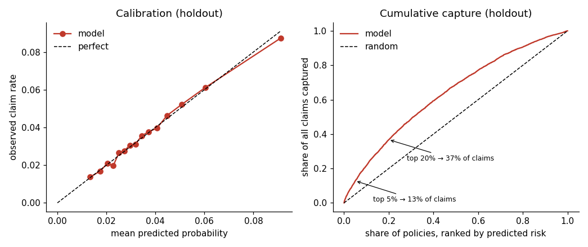
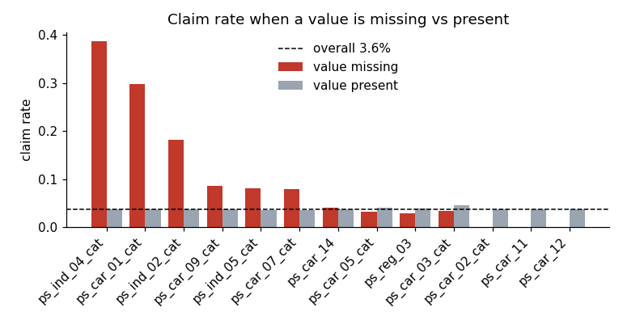
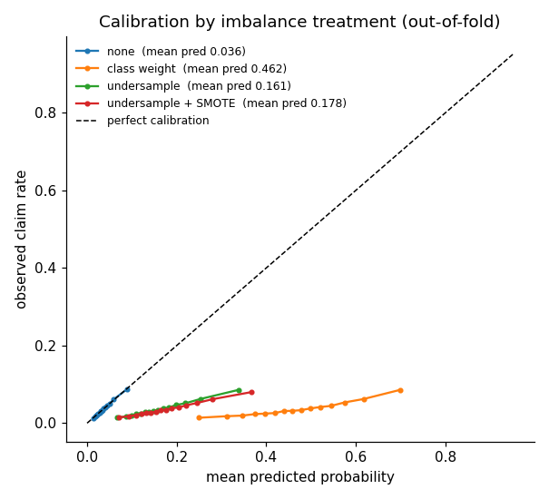
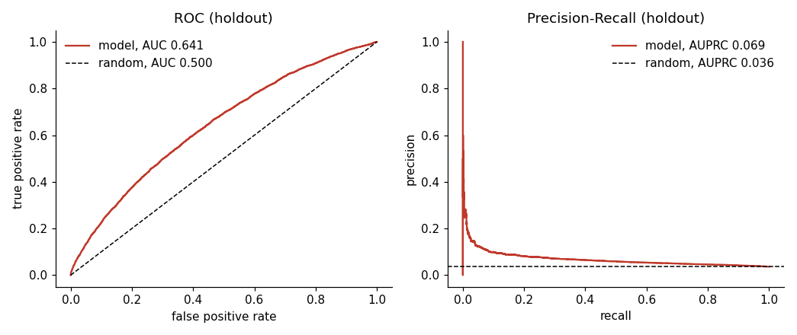
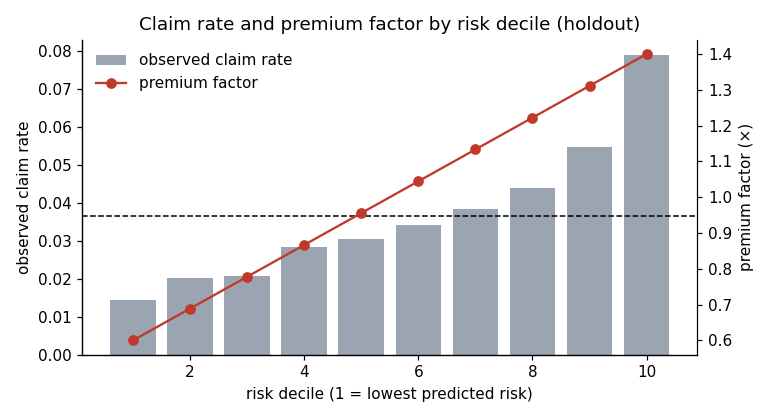
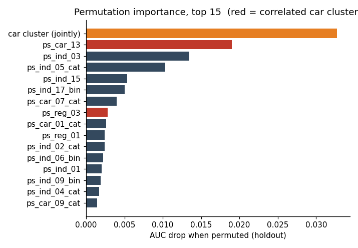

# Insurance Claim Risk Ranking
### Ranking 595K auto insurance policies by claim probability, with a pricing tier attached to each score

> **Predicting "no claim" for every policy is 96.4% accurate and worthless.** 3.6% of policyholders file a claim, so the job is not classification but ranking: which policies deserve a higher premium, and by how much. A gradient boosted model reaches AUC 0.641 (Gini 0.283) on a locked holdout, against 0.619 for a logistic regression on the same features. The top decile of predicted risk claims at 7.9%, the bottom decile at 1.4%, a 5.5x spread that supports a premium band from 0.6x to 1.4x. Resampling for class imbalance, the standard reflex on a 26:1 dataset, did not improve the ranking and pushed the predicted claim rate to 4 to 13 times the true rate, so the final model is trained on the real distribution and its probabilities are used directly.



---

## 1. Business context

An insurer writing electric vehicle policies prices every customer against one base rate. Claim frequency on the EV book has been running above the portfolio average, and a flat rate means low risk drivers subsidize high risk ones until they leave. The pricing team asked for a per-policy risk score that ranks customers reliably and is calibrated well enough to move premiums by up to ±40%.

**The data.** 595,212 policies with a claim / no claim outcome for the policy year, plus 892,816 unlabeled policies to be scored. 57 features are provided, but their meanings are withheld: only a group (`ind`, `reg`, `car`, `calc`) and a type suffix (`_bin`, `_cat`, none) are known.

**The constraint.** With feature names masked, none of the usual domain-driven feature engineering is available. Every decision in this project is driven by variable *type* and verified by experiment under one fixed evaluation protocol.

**The questions.**
1. How well can claims be ranked from these features?
2. Does the 26:1 class imbalance need to be handled, and at what cost?
3. Can the scores support the ±40% premium band the brief asks for?

---

## 2. Evaluation protocol, fixed before any model

The unlabeled file carries no outcomes, so all evaluation is carved from the labeled file:

```
595,212 labeled policies
  ├── 80%  development set (476,169)   every experiment runs here under 5-fold stratified CV
  └── 20%  holdout (119,043)           untouched until section 6, scored once
```

Every experiment produces out-of-fold predictions under the same fold split and is scored with the same metrics. Anything that has to be fit (imputers, target encodings, resampling) is fit inside the training portion of each fold; the validation portion always keeps its real 3.6% claim rate.

| Metric | Why it is here |
|---|---|
| AUC / Gini (= 2·AUC − 1) | ranking quality; Gini is the convention in insurance |
| AUPRC | reported against its own baseline of 0.036, the claim rate |
| Capture @ 5% | share of all claims inside the top 5% of predicted risk, the number pricing acts on |
| Mean predicted probability | should equal 0.036; any other value means the probabilities cannot be used for pricing |

---

## 3. Baselines

| Model | AUC | Gini | Capture @ 5% |
|---|---:|---:|---:|
| Logistic regression, all 57 features, median-imputed and standardized | 0.619 | 0.239 | 10.9% |
| XGBoost, all 57 features, no imputation, no encoding, no resampling, untuned | 0.640 | 0.279 | 12.4% |

The model class is worth two AUC points. Everything in the next two sections is measured against the second row, and moves the third decimal. That is the expected shape of this problem: most of the work below is subtraction and verification, and its product is a model whose every input is justified and whose probabilities can be used, not a large jump in AUC.

---

## 4. Data decisions

Each of these was checked with a number that changed the decision.

| Issue | Finding | Decision | ΔAUC |
|---|---|---|---:|
| **Missing values** (coded −1) | Missingness is not random. Policies missing `ps_car_07_cat` or `ps_ind_05_cat` claim at 2.2x the base rate; policies missing `ps_car_03_cat` (69% missing) or `ps_reg_03` claim at 0.73x | No imputation; `NaN` is passed to the model natively. Nothing is dropped for a high missing rate | — |
| **20 `calc` features** | Every one has single-feature AUC below 0.504, indistinguishable from noise; the `reg` group averages 0.546 | Dropped | +0.0016 |
| **Explicit missing indicators** | Add nothing the model was not already reading from `NaN` | Kept at zero cost; they make missingness a named input for section 7 | −0.0004 |
| **`ps_car_11_cat`**, 104 levels | Too wide for one-hot; label codes impose a false order | Out-of-fold target encoding, smoothed toward the prior | +0.0001 |
| **Pairwise products of continuous features** | 40 extra columns | Not used; the trees represent interactions by nesting splits | −0.0010 |
| **Correlated `car` / `reg` features** (r up to 0.74) | No effect on a tree model's predictions; distorts importance attribution only | Retained; importance is read at the block level in section 7 | — |



---

## 5. Class imbalance: an experiment, not a default

Four treatments, each applied inside the training fold only, scored on validation folds at the real class ratio.

| Treatment | AUC | Gini | Capture @ 5% | Mean predicted probability |
|---|---:|---:|---:|---:|
| None | **0.641** | 0.282 | 12.8% | **0.036** |
| Class weight (`scale_pos_weight` = 26) | 0.640 | 0.281 | 12.6% | 0.462 |
| Undersample to 1 : 5 | 0.640 | 0.280 | 12.4% | 0.162 |
| Undersample + BorderlineSMOTE to 1 : 2 | 0.632 | 0.264 | 11.5% | 0.178 |



None of them improves the ranking, and every one of them breaks calibration: a model trained on a world where claims are common predicts that claims are common. Class weighting is the worst offender, predicting a 46% claim rate on a 3.6% population. The ranking a gradient boosted model learns does not depend on the class ratio, so there is nothing for resampling to fix, and the probabilities it damages are exactly what pricing needs.

**Decision: no resampling, no class weighting.** The one place resampling changes a number for the better is a validation set that has itself been resampled, which is how an AUC of 0.85 appears in a first pass and disappears once the validation fold is left at its real distribution.

---

## 6. Model and holdout results

XGBoost, 678 trees at learning rate 0.03, depth 4, minimum child weight 20, row and column subsampling at 0.8. The tree count comes from early stopping on one fold; a four-point grid over depth and leaf size moved AUC by 0.002 and was kept only because it beat the untuned configuration under the same cross-validation (0.6419 vs 0.6412). Final input: 37 non-`calc` columns, the missing indicators and count, and the target-encoded `ps_car_11_cat`, 50 columns.

Refit on the full development set, scored once on the 20% holdout:

| | Holdout |
|---|---:|
| AUC | 0.641 |
| Gini | 0.283 |
| AUPRC (baseline 0.036) | 0.069 |
| Capture @ 1% / 5% / 10% / 20% | 3.9% / 12.8% / 21.7% / 36.7% |
| Lift @ 5% | 2.55x |
| Mean predicted probability | 0.0365 (true rate 0.0364) |
| Labeled vs unlabeled adversarial AUC | 0.501 |



Cross-validated and holdout AUC agree to the third decimal, so the development set was not overfit. The adversarial check trains a classifier to tell the labeled file from the unlabeled one; at 0.501 it cannot, so the scores transfer to the book to be priced.

**On the size of the AUC.** 0.64 is low by the standard of most classification benchmarks and ordinary for claim frequency. Whether a given policy claims in a given year is mostly chance; the features describe the driver and the vehicle, not the accident, and here their meanings are also masked. The number that matters for pricing is the spread of observed risk across score deciles, below.

**On the brief.** The requirement was that the top 5% of policies contain 65% of claims. The holdout gives 12.8%. No model on these features approaches 65%; the requirement describes a level of predictability the data does not contain, and the honest deliverable is a defensible premium spread rather than a target that cannot be met.

---

## 7. From score to premium

The holdout is cut into ten risk deciles. Each decile's observed claim rate is its relative risk; a premium factor runs linearly from 0.6x (decile 1) to 1.4x (decile 10), rescaled so the book's total premium is unchanged.

| Decile | Observed claim rate | Relative risk | Share of all claims | Premium factor |
|---:|---:|---:|---:|---:|
| 1 (lowest) | 1.43% | 0.39 | 3.9% | 0.60 |
| 2 | 2.01% | 0.55 | 5.5% | 0.69 |
| 3 | 2.07% | 0.57 | 5.7% | 0.78 |
| 4 | 2.85% | 0.78 | 7.8% | 0.87 |
| 5 | 3.05% | 0.84 | 8.4% | 0.96 |
| 6 | 3.43% | 0.94 | 9.4% | 1.04 |
| 7 | 3.84% | 1.05 | 10.5% | 1.13 |
| 8 | 4.40% | 1.21 | 12.1% | 1.22 |
| 9 | 5.48% | 1.50 | 15.0% | 1.31 |
| 10 (highest) | 7.90% | 2.17 | 21.7% | 1.40 |



Observed claim rate rises monotonically across deciles and the top decile claims at 5.5 times the rate of the bottom, so the 0.6x to 1.4x band asked for in the brief sits well inside the risk spread the data supports; the model would justify a wider one. Mean predicted probability tracks observed claim rate within 0.3 points in every decile, which is what makes the factors usable without a separate calibration step. `outputs/policy_scores.csv` carries a probability, decile and premium factor for each of the 892,816 unlabeled policies.

**Interpretability.** Feature importance is measured by permutation on the holdout rather than the model's internal gain, because gain is measured on training data and divides credit among correlated features. `ps_car_13` (AUC drop 0.019), `ps_ind_03` (0.013) and `ps_ind_05_cat` (0.010) lead. The correlated `car`/`reg` block is also permuted jointly: its joint AUC drop of 0.033 exceeds the sum of its members' individual drops, which is what correlation does to per-feature importance and why the block is read as one input.



---

## 8. Limitations

- **Frequency only.** Claim severity is not in the data; full pricing needs a frequency × severity model.
- **Single policy year.** Stability of the ranking over time is assumed, not shown.
- **Masked features** rule out domain-driven engineering and mean a regulator can be told that `ps_car_13` matters, not what it is.
- **Premium factors are illustrative.** A production rate change would go through filing and elasticity analysis; the decile table shows what the risk spread supports, not what to file.

---

## 9. Repository layout and reproduction

```
insurance_claim_risk_ranking/
├── README.md
├── requirements.txt
├── .gitignore
├── notebooks/
│   └── insurance_claim_risk_ranking.ipynb   # the whole analysis, 12 sections
├── figures/                                 # written by the notebook
├── outputs/
│   ├── results.json                         # every number quoted above
│   └── policy_scores.csv                    # not committed; regenerated by section 10
└── data/                                    # not committed; downloaded on first run
```

The two data files (train.gz 27 MB, test.gz 41 MB) are pulled automatically from a shared folder on first run; no account is needed:

https://drive.google.com/drive/folders/1mv6Y5N13Pm5hBExm14kXL-U6qjwjtwGn?usp=sharing

```bash
pip install -r requirements.txt
jupyter lab notebooks/insurance_claim_risk_ranking.ipynb
```

Runs end to end in about 20 minutes on a laptop; the cross-validation experiments in sections 4 to 8 dominate. Python 3.10+, no GPU. On Colab, run the notebook as is and download `figures/` and `outputs/results.json` at the end.
