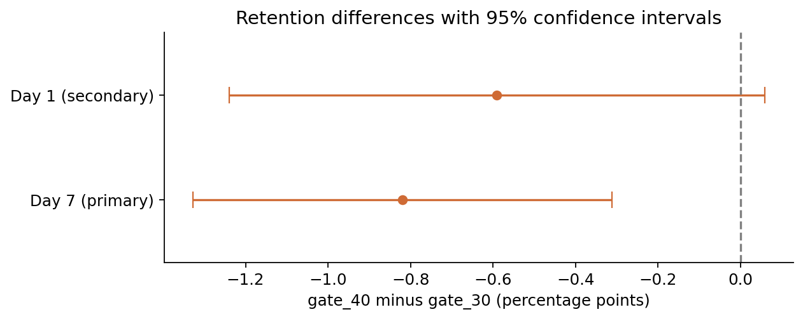
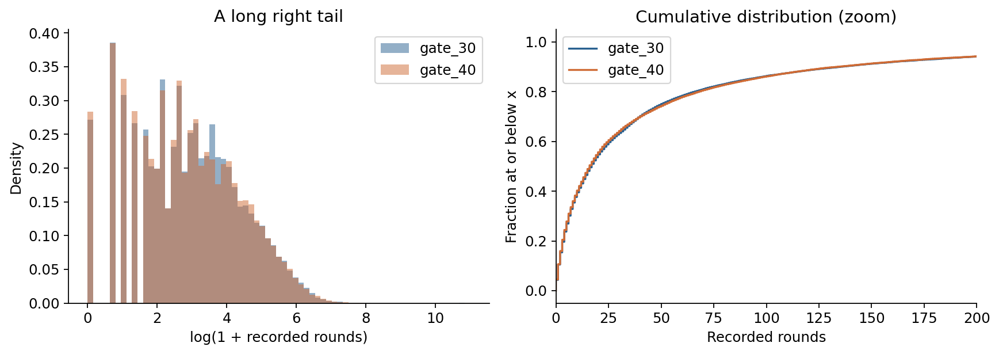
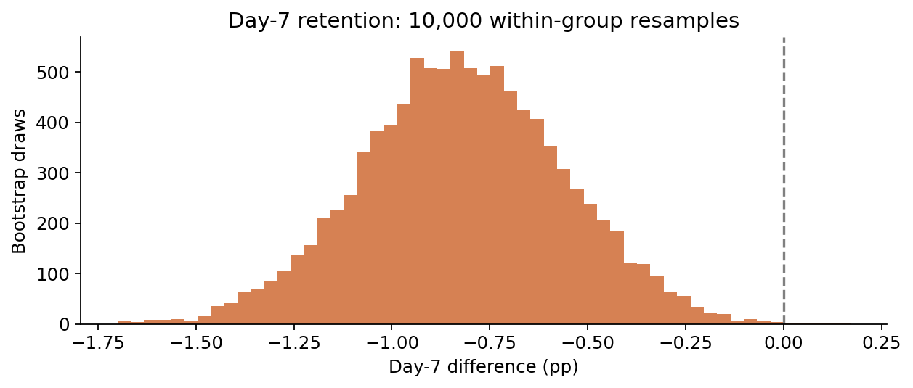

# Mobile Game Retention A/B Test
## Does moving the first gate improve retention?
### 90,189 players · level 30 vs level 40 · Python and SQL

> **Should the first gate move from level 30 to level 40?** Day-7 retention falls from **19.02% to 18.20%** — a **0.82 percentage-point decline**, or **4.3% relative to control**. The 95% confidence interval is −1.33 to −0.31 pp. A within-group bootstrap gives a similar interval, and both intervals exclude zero.
>
> **Is there an engagement gain that could offset the decline?** Neither raw nor capped game rounds shows a clear mean difference. Revenue is unavailable, so the retention–monetization trade-off remains unresolved.
>
> **Decision:** keep the first gate at level 30, pending verification of allocation and data collection. Assuming a 50/50 design, group counts raise an allocation diagnostic (p = 0.0086). The intended ratio must be confirmed before treating the estimates as rollout-ready evidence.



[View the full analysis](notebooks/gate_experiment_analysis.ipynb)

---

## 1. Framing

A progression gate introduces friction into a mobile game. Moving the first gate later could give players more time to become invested, but the effect on return behavior needs to be measured.

| Question | Metric | Decision informed |
|---|---|---|
| Does the later gate improve return behavior? | Day-7 retention — primary | whether to move the first gate |
| Does it change early return behavior? | Day-1 retention — exploratory | how early an effect appears |
| Is engagement higher? | Recorded game rounds — exploratory | whether retention comes with an engagement trade-off |
| What happens to monetization? | Revenue per player — unavailable | whether the overall product trade-off is worthwhile |

**Control:** `gate_30`. **Treatment:** `gate_40`. Every difference is **treatment minus control**. Negative retention differences favor the current gate.

Day-7 retention is the only primary outcome. Day-1 retention and game rounds are exploratory supporting analyses; their p-values are not used to claim additional discoveries. These metric roles define this analysis. The original experiment protocol is unavailable, so random assignment, independent player observations, and complete outcome collection remain assumptions for inference.

---

## 2. Data decisions

The [player-level dataset](https://drive.google.com/file/d/1CVMsQtjLeW-pf_LN0cm5zlaWTn1tjeyF/view?usp=sharing) contains 90,189 unique players: 44,700 in `gate_30` and 45,489 in `gate_40`.

| Issue | Evidence | Decision | Reason |
|---|---|---|---|
| Missing or duplicate records | No missing required values; no duplicate IDs | Validate before analysis | Incorrect denominators would change retention estimates |
| Zero recorded rounds | 3,994 players | Keep in the assigned group | Filtering on post-assignment behavior could bias comparisons |
| Day-7 return without day-1 return | 3,599 players | Keep | The flags describe separate days, not continuous activity |
| Extreme game-round count | Maximum 49,854; next highest 2,961 | Keep raw results; add a capped sensitivity analysis | The record is suspicious, but the CSV cannot establish its cause |
| Skewed rounds | Median 16–17; means near 52 | Report means, medians, and distribution plots | A small number of heavy players strongly influences the mean |
| Rounds metadata | Exact observation window not encoded in the CSV | Use “recorded rounds” | Avoid asserting an unsupported 7- or 14-day window |

**Rounds are not levels.** A player with 30 recorded rounds cannot be assumed to have reached level 30.



---

## 3. Can the allocation be trusted?

Under an assumed 50/50 allocation, a chi-square goodness-of-fit test gives **p = 0.0086**. This falls below the 1% review threshold used in this analysis. It is a reason to investigate, not proof that assignment failed. Unequal group sizes by themselves do not invalidate a two-sample test.

The zero-round shares are 4.33% and 4.52% (p = 0.169). This diagnostic does not detect a clear difference, but it cannot establish group equivalence or resolve the allocation concern. Startup behavior and logging could also affect zero-round counts.

**What is needed:** confirm the intended ratio and inspect assignment and event counts by date, device, country, and acquisition channel. Those fields are absent, so the estimates below remain conditional on a valid experiment and complete data.

---

## 4. Retention: how much changes?

| Metric | gate_30 | gate_40 | Difference | 95% CI | Two-sided p-value |
|---|---:|---:|---:|---|---:|
| **Day-7 retention** | **19.02%** | **18.20%** | **−0.82 pp** | **[−1.33, −0.31] pp** | **0.0016** |
| Day-1 retention | 44.82% | 44.23% | −0.59 pp | [−1.24, +0.06] pp | 0.0744 |

The day-7 interval excludes zero. The estimate corresponds to approximately **8 fewer day-7 returning players per 1,000 installs**. It does not measure continuously active users or monthly active users.

The day-1 interval includes zero and permits both a decline and a near-zero effect. A nonsignificant result does not demonstrate no effect, and it does not establish inadequate sample size as the explanation.

**Method.** Two-proportion z-tests use the pooled rate under the equal-rate null. Confidence intervals use separate group rates, without imposing the null. Both groups have enough retained and non-retained players for a large-sample approximation. Intervals are pointwise 95% intervals, not simultaneous intervals across all outcomes.

---

## 5. Engagement: the extreme-value decision matters

| Analysis | gate_30 mean | gate_40 mean | Difference | 95% CI | p-value |
|---|---:|---:|---:|---|---:|
| Raw recorded rounds | 52.46 | 51.30 | −1.16 | [−3.72, +1.40] | 0.3759 |
| Capped rounds — sensitivity | 49.14 | 48.85 | −0.28 | [−1.38, +0.82] | 0.6152 |

For the sensitivity analysis, values above the pooled 99th percentile are capped at **493 rounds**; 898 players are affected. Every player remains in the analysis. Capping changes the target quantity and creates ties among high values: it is not simply a more precise estimate of actual average gameplay.

Welch's test compares means without assuming equal group variances. The raw interval is sensitive to the extreme tail and should be treated cautiously. The capped interval treats the observed cap as fixed and does not account for selecting that cap from the same data. A future experiment should use a justified historical threshold.

**Finding:** neither analysis establishes a clear engagement gain. Neither proves equivalence or that every plausible difference is too small to matter.

---

## 6. Cross-checks and uncertainty



- **SQL:** group sizes and day-1/day-7 retained counts exactly match pandas aggregation. This checks calculation consistency, not upstream collection quality.
- **Bootstrap:** 10,000 within-group resamples give a day-7 interval of approximately **−1.33 to −0.32 pp**, close to the analytic interval. Binary outcomes use the exact binomial shortcut for resampled success counts.

All methods use the same underlying players. Agreement is a sensitivity check, not independent replication.

---

## 7. Recommendation and next steps

**Retain the first gate at level 30, subject to resolving the allocation and data-quality questions.** The observed day-7 retention result favors the current gate, with no clear compensating gain in measured engagement.

At an illustrative 500,000 installs per month, transporting the estimated effect would imply about **4,100 fewer day-7 returners per monthly install cohort** (95% interval: approximately 1,600–6,600). This is a scenario calculation, not measured business loss or a revenue estimate.

Before a rollout decision:

1. Confirm intended allocation and reconcile assignment and event logs.
2. Verify outcome maturity and the recorded-rounds observation window.
3. Add revenue per player and day-30 retention to evaluate the complete product trade-off.
4. For a follow-up experiment, specify the minimum worthwhile effect, sample size, guardrails, and stopping rule before launch.

The data does not establish why the effect occurs. It also does not show that a gate earlier than level 30 would improve retention.

---

## 8. Limitations

- **Original protocol unavailable:** cannot verify prespecified metrics, intended allocation, stopping behavior, or test duration.
- **No assignment or exposure logs:** cannot confirm implementation or which players reached a gate.
- **No dates:** cannot verify complete day-7 follow-up or inspect time-dependent effects.
- **No pretreatment characteristics:** cannot assess balance by device, geography, or acquisition channel.
- **Possible player interactions:** independent-player assumptions cannot be verified from this extract.
- **No monetization or longer-term outcomes:** retention alone does not settle the full product decision.
- **Extreme engagement tail:** raw mean inference is sensitive to rare large observations; capped means answer a different question.

---

## 9. Repository layout and reproduction

| Path | Contents |
|---|---|
| `README.md` | Business question, findings, methods, and limitations |
| `notebooks/gate_experiment_analysis.ipynb` | Complete analysis with saved outputs |
| `figures/` | Three figures generated by the notebook |
| `outputs/results.json` | Estimates, analysis settings, data fingerprint, and runtime versions |
| `outputs/*.csv` | Retention, rounds, and bootstrap summaries |
| `requirements.txt` | Pinned dependencies for local setup |
| `.gitignore` | Excludes downloaded data, environments, and temporary files |

### Data source

The dataset is available as
[gate_experiment.csv on Google Drive](https://drive.google.com/file/d/1CVMsQtjLeW-pf_LN0cm5zlaWTn1tjeyF/view?usp=sharing).

The notebook reads a local copy when available and downloads the CSV using
`gdown` otherwise. The public data download does not require Drive mounting.

The setup uses an existing `Data/` folder first, falls back to an existing
`data/` folder, and creates `Data/` if neither exists. The raw CSV is excluded
from Git commits.

### Running locally

From the project root:

```bash
pip install -r requirements.txt
jupyter notebook notebooks/gate_experiment_analysis.ipynb
```

Run all cells from a fresh kernel. Local execution supports launching Jupyter
from either the project root or its `notebooks/` directory.

### Running in Google Colab

The Colab setup mounts the runner's own Google Drive so that generated figures
and tables are saved persistently.

Place the project folder at:

```text
My Drive/DS_Project_Portfolio/Mobile_game_retention_ABtest/
```

Open `notebooks/gate_experiment_analysis.ipynb` with Colab, run all cells,
and authorize Drive access when prompted. If your project is stored elsewhere,
update `PROJECT_DIR` in the setup cell.

This Drive connection is used for saving project files; it is separate from
downloading the publicly shared dataset.

### Outputs and reproducibility

Figures are saved to `figures/`; CSV summaries and `results.json` are saved to
`outputs/`. Running the notebook overwrites these generated files.

Save the notebook after execution to preserve its code and displayed outputs.
When running in Colab, wait for saving to finish before downloading the project
folder from Drive.

`results.json` records the random seed, analysis settings, dataset SHA-256,
and the package versions used for that run. Colab's installed versions may
differ from the pinned local dependencies.

Retention differences in the exported CSV/JSON files are stored as fractions.
Multiply by 100 to express them in percentage points.

The repository's `.gitignore` excludes the downloaded CSV for Git-based uploads. Browser uploads do not apply `.gitignore`; you can omit the CSV because the public download link is provided above. The project ZIP does not include it.

Random seeds and the CSV fingerprint are recorded in `outputs/results.json`. Retention differences in raw CSV/JSON summaries are fractions: multiply by 100 for percentage points. Display tables and charts label their units explicitly.
