# Three stakeholders, three questions, one Yelp dataset
### 174,565 businesses · 16.6M check-ins · 5.26M reviews · 1.1M tips · 11 metro areas

> **When should a merchant staff up?** Friday 18:00 is the busiest hour of the week. Restaurants run two sharp peaks — 16.6% of their traffic in the lunch hour, 28.4% in the dinner window — while every other business type sits on a flat 10:00-17:00 plateau holding 55%. One staffing rule cannot serve both.
>
> **What separates a 2-star restaurant from a 4.5-star one in what customers write?** Not service: mentioned in 15.3% of high-star tips and 16.4% of low-star tips. Waiting appears 2.9x more often in low-star tips and cleanliness 3.1x. That is where a limited improvement budget belongs.
>
> **Is the Elite programme selecting better reviewers?** Elite users are 4.6% of accounts and write 23.8% of reviews. Their reviews are 1.8x longer, collect 2.6x more useful votes, and are 3.8x less likely to be one-star. Elite selects a rating behaviour — reviewers who use the middle of the scale — not louder enthusiasts.

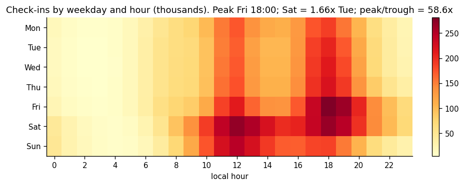

---

## 1. Framing

The [Yelp Open Dataset](https://www.kaggle.com/datasets/yelp-dataset/yelp-dataset) is usually used as an NLP benchmark. Here it is treated the way an analyst inside the company would treat it: **who is asking, and what decision does the answer change?**

| Stakeholder | Question | Tables | Decision informed |
|---|---|---|---|
| Merchant | When do customers show up, and does it differ by business type? | check-in, business | staffing and opening hours |
| Merchant | What do unhappy customers write that happy ones don't? | tip, review, business | which operational fix to fund first |
| Platform | Is the Elite programme selecting better reviewers? | user, review | whether Elite status deserves ranking weight |

Each answer is a number someone can act on. The methods are chosen for interpretability rather than accuracy, because none of these three decisions is a prediction problem — and in Q2 that choice is what surfaced a confound a classifier would have hidden.

---

## 2. Data decisions

Each of these changes an answer downstream.

| Issue | Size | Decision | Reason |
|---|---|---|---|
| **Check-in `hour` is UTC** | all 3.9M rows | convert per business state, rolling the weekday over with the hour | Aggregated as given, the weekly peak is Saturday 01:00 — for dentists as much as for bars. Peak hour by metro was 02:00 (NV), 01:00 (AZ), 23:00 (ON), 18:00 (Edinburgh), 17:00 (Stuttgart): gaps that match the UTC offsets exactly. After conversion all five peak at 18:00. 99.99% of check-ins mapped |
| **Weekday rollover** | — | `local_day = (weekday + (hour+offset)//24) % 7` | A 02:00 UTC Saturday check-in in Las Vegas is Friday 18:00 local. Shifting only the hour moves the entire Friday evening peak onto Saturday — and Friday 18:00 is the busiest hour in the dataset |
| **`city` is free text** | 22 spellings of "Las Vegas" | group geography by `state` | city-level cuts silently split a metro |
| **`categories` is multi-valued** | 1,294 distinct tags | `explode` per business | joining every business's string and splitting once glues one business's last tag to the next one's first, inflating the tag count ~45x |
| **Closed businesses** (`is_open = 0`) | 16.0% | keep and analyse | dropping them hides the closure pattern below |
| **`neighborhood`** | 61.0% missing | drop | unusable |
| **Per-user review counts** | 5.26M rows | full groupby, never a sample | sampling reviews then counting per user compresses the distribution toward 1: a user with 100 reviews appears with ~100p of them, a user with 1 appears with probability p and still has 1 |
| **Skewed correlations** | — | correlate on logs | check-ins and review counts are extreme right-skew; a raw correlation measures whether a handful of huge venues line up |

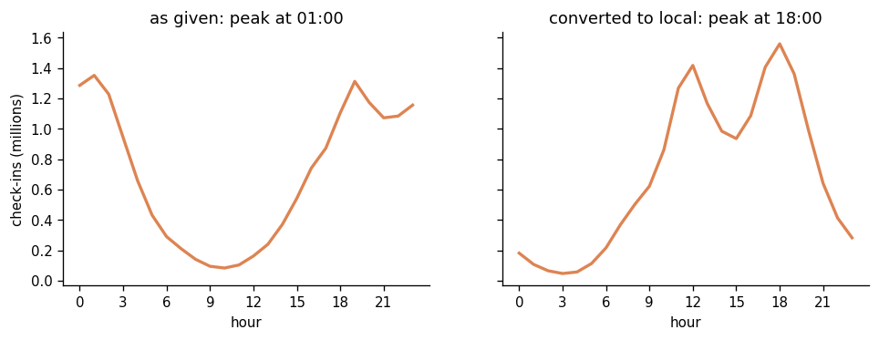
*The same 16.6M check-ins by raw `hour` (left) and after per-state conversion to local time (right). The peak moves from 01:00 to 18:00 and a lunch peak appears that the raw data hides.*

**Result:** 174,565 businesses (84.0% open, 31.3% restaurants), 16.6M check-ins across 18 mapped regions, 5,261,668 deduplicated reviews, 1,098,319 tips.

---

## 3. The market being described

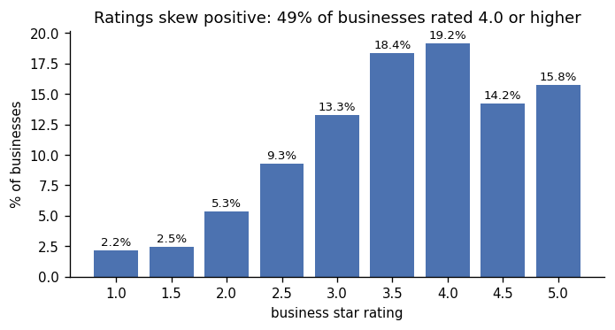

- **Ratings skew positive.** 49.2% of businesses are rated 4.0 or higher; the median is 3.5.
- **Restaurants are 31.3% of businesses but 55.6% of check-ins.** After them: Shopping (28.0K), Food (24.8K), Beauty & Spas (17.0K), Home Services (16.2K), among 1,294 distinct tags.
- **Attention is concentrated.** The median business has 8 reviews and only 6.0% have 100 or more. The top 1% of businesses hold 23% of all reviews, the top 10% hold 62%, the top 20% hold 77%.

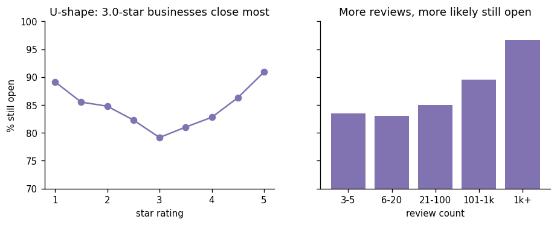

Closure is U-shaped in rating: 3.0-star businesses have the lowest survival (79.2%), while 1.0-star (89.2%) and 5.0-star (90.9%) survive more. **This is not evidence that bad reviews help.** Extreme ratings come from businesses with very few reviews, which are disproportionately new and have had less time to close. Review count is the cleaner signal: 83.5% open at 3-5 reviews rising to 96.7% at 1,000+. Restaurants close far more than everything else (74.0% vs 88.6%). `is_open` is a snapshot with no closure date, so this is descriptive; a hazard model would need closure timestamps.

---

## 4. Q1 — When do customers show up?

Check-ins are the only table recording behaviour at the venue rather than commentary written afterwards, which means their bias does not overlap with the text-based results below.

From the heatmap at the top of this page:

- **Friday 18:00 is the busiest hour of the week** (280,831 check-ins), followed by Saturday 12:00 (269,189) and Saturday 18:00 (265,887). The quietest hour, Wednesday 03:00, has 4,794 — a **58.6x** spread.
- **Weekends are heavier, but less than intuition suggests.** Saturday carries 19.7% of the week, Sunday 15.2%, Tuesday 11.9%. Saturday is 1.66x Tuesday, not three or four times.
- **Dinner beats lunch.** 17:00-21:00 holds 35.8% of all check-ins; 11:00-14:00 holds 29.0%.

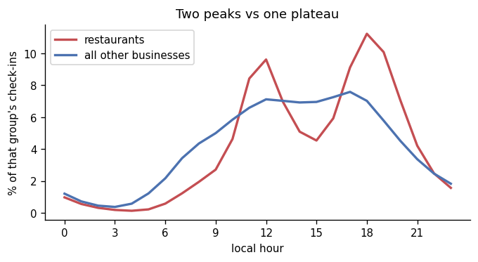

Because restaurants are 55.6% of check-ins but 31.3% of businesses, an absolute comparison would only restate that restaurants are more numerous. **Each group is normalised by its own total**, which turns the chart into "what does a day look like for this type of business":

| | Restaurants | Everything else |
|---|---:|---:|
| 12:00-13:00 | **16.6%** | — |
| 18:00-20:00 | **28.4%** | — |
| 10:00-17:00 block | — | **55.3%** |

**Is a check-in a usable proxy for footfall?** Three checks: 84% of businesses have at least one (broad coverage); log check-ins correlate 0.75 with log review count, an independent popularity measure from a different table; the median business collects 1.02 check-ins per review (sane order of magnitude). The pattern is not driven by a handful of nightlife venues.

**Limits.** Check-ins measure customers who open the Yelp app at a venue, over-representing restaurants, nightlife and younger customers. The table has no dates, only weekday × hour, so it shows no seasonality, trend or holiday effect. Timezone conversion uses standard-time offsets, so roughly half the observations blur by an hour; Arizona, which does not observe DST, peaks at 18:00 alongside the rest.

---

## 5. Q2 — What do unhappy customers write that happy ones don't?

"Improve service" is advice every low-rated restaurant already has. It is not actionable because it is not *differential*. So the question is which words appear in low-star text at a rate they do not appear in high-star text.

**Groups:** restaurants only — 8,008 rated 4.5+ (108,124 tips) versus 4,424 rated ≤2.0 (14,950 tips). Tips rather than reviews: median 49 characters, almost no filler, 64% business coverage.

**Method.** For every word appearing at least 80 times across both groups:

```
log_odds(w) = log( (count_hi + 1) / (N_hi + 1) ) − log( (count_lo + 1) / (N_lo + 1) )
```

Ratios rather than counts because the high-star group has 7x more text. Logs because a plain ratio is asymmetric — "4x more common in low-star" is 4.0 while "4x more common in high-star" is 0.25, so equal evidence sits 3.0 units from neutral on one side and 0.75 on the other; logs make the directions symmetric and the words plottable on one axis. The +1 is additive smoothing: `tapas` appears zero times in the low-star group, which is `log(0)` unsmoothed. The count floor keeps 1,410 of 31,690 words; re-running at 50 and 150 does not change the ranked extremes.

Not TF-IDF: TF-IDF is a within-document weighting built for retrieval and scores how well a word characterises *one document*. Pooling each group into a single document collapses IDF to two possible values, zeroing out every word that appears in both groups — which is exactly where the contrast lives.

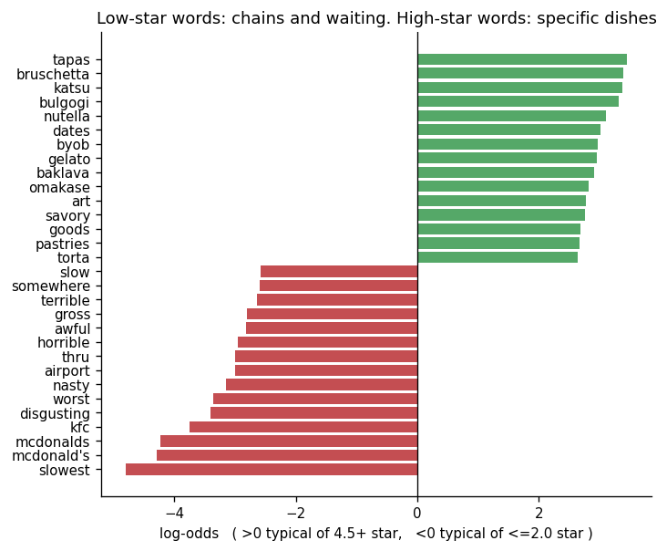

- **High-star tips name specific dishes** — *tapas, bruschetta, katsu, bulgogi, omakase, gelato, baklava*. **Low-star tips carry generic disgust and slowness** — *slowest, disgusting, worst, nasty, awful, gross*.
- **The low-star list is full of chain names** — *mcdonald's, kfc, thru, airport*. Rating and category are confounded here, so a model predicting stars from review text would partly learn a fast-food detector. Any such model needs category controls. An interpretable method surfaced this; a classifier would have hidden it.

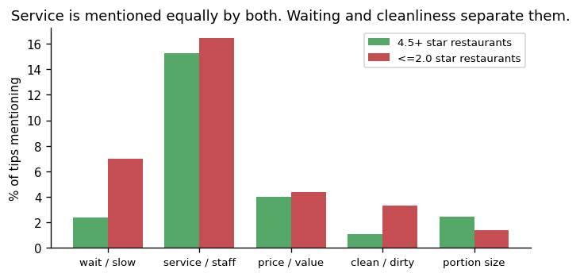

Log-odds ranks words but gives no magnitude, so a second pass measures what share of tips mention each of five keyword themes:

| Theme | 4.5+ star | ≤2.0 star | Ratio |
|---|---:|---:|---:|
| service / staff | 15.3% | 16.4% | 1.08 |
| **wait / slow** | 2.4% | 7.0% | **2.91** |
| **clean / dirty** | 1.1% | 3.3% | **3.10** |
| price / value | 4.0% | 4.4% | 1.08 |
| portion size | 2.4% | 1.4% | 0.58 |

**Service is a non-finding** — mentioned equally by both groups, so it carries no signal about which restaurant you are in. Waiting and cleanliness are what discriminate. Portion size runs the other way: praised more than complained about.

**Limits.** Keyword families miss paraphrase ("we were there for ages"). The clean/dirty family counts *mentions of the topic*, not complaints — `clean` scores −0.44 on log-odds because good restaurants get praised for it, while `dirty` scores −2.41. With 108K and 15K tips, sampling error is under 0.3pp; self-selection, not sample size, is the real caveat.

---

## 6. Q3 — Is the Elite programme selecting better reviewers?

Content creation is extremely concentrated: **52.7% of reviewers wrote exactly one review**, 69.3% wrote two or fewer, while the top 1% wrote 23.6% of all reviews and the top 10% wrote 56.5%. Tips are more concentrated still (57.2% of authors wrote one; top 1% wrote 29.8%). That makes the contributor base fragile, and Elite is the retention lever aimed at the heavy end.

Elite is a small badge: **60,818 of 1,326,100 accounts (4.6%)**, and those accounts write **23.8%** of all reviews — roughly six times the output per account.

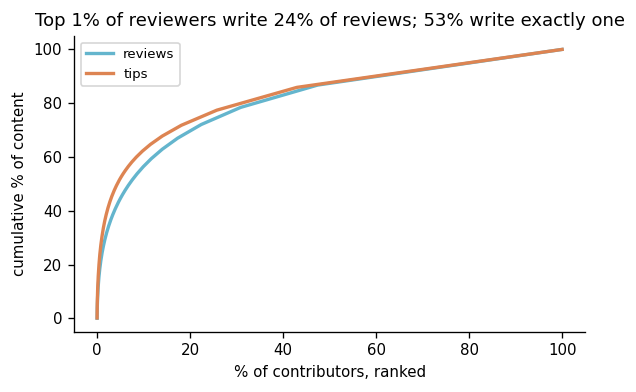

"Better" is not measurable until it is operationalised, and every single measure has an obvious rebuttal. Four are used **because they fail for different reasons** — convergence across them is worth more than one clean number.

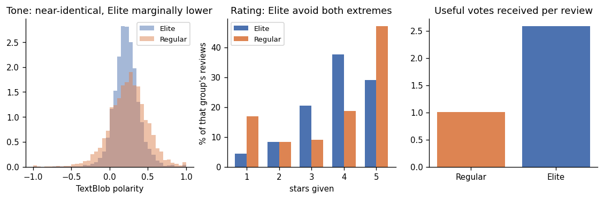

| Measure | Elite | Regular | |
|---|---:|---:|---|
| Reviews written | 1,253,052 (23.8%) | 4,008,616 | |
| Median review length | 687 chars | 374 chars | 1.84x |
| Useful votes per review | 2.59 | 1.01 | 2.57x |
| Mean stars given | 3.79 | 3.71 | — |
| Share 5-star | 29.1% | 47.1% | |
| Share 1-star | 4.4% | 16.9% | 3.84x |
| Mean TextBlob polarity | 0.222 | 0.244 | |

The means are nearly identical while the **distributions** are not: Elite give far fewer 5-star *and* far fewer 1-star ratings, two opposite shifts that cancel in an average. Regular ratings are close to bimodal — love it or hate it — while Elite ratings carry gradation, which is what fine-grained ranking needs.

Sentiment is computed on a stratified sample of 20,000 reviews per group rather than all 5.26M: TextBlob scores token by token in Python, and with a polarity standard deviation near 0.24 the standard error of a group mean is 0.24/√20000 ≈ 0.0017 — roughly a thirteenth of the difference being measured. Sampling per group rather than from the pool keeps both groups equally precise.

**Answer.** Elite selects a *rating behaviour* — reviewers who write longer, sound more restrained, and avoid both extremes — not louder enthusiasts.

**The caveat that comes with it.** The 2.6x useful-vote advantage is **not** clean evidence of quality.

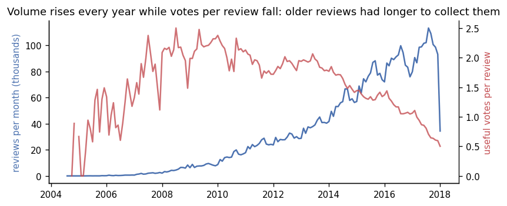

Votes accumulate with age and Elite users skew older on the platform; display position is a second confound, since a review ranked higher is seen and voted on more. Neither is removable observationally. The clean test is a ranking experiment: randomise display position and measure useful votes per review within 30 days of posting. This analysis defines that metric; it does not settle the question.

Elite status is also awarded partly *because* someone writes long, well-received reviews, so this describes who holds the badge rather than what the badge causes. "Ever Elite" is used rather than "Elite at time of writing" — the conservative choice, since it places some pre-Elite reviews in the Elite bucket and biases against finding a difference.

---

## 7. One merchant, end to end: Gen Korean BBQ House

Henderson NV, 4.0★, 1,652 reviews, 3,429 check-ins, 376 tips — the business with the most 5-star reviews in the dataset.

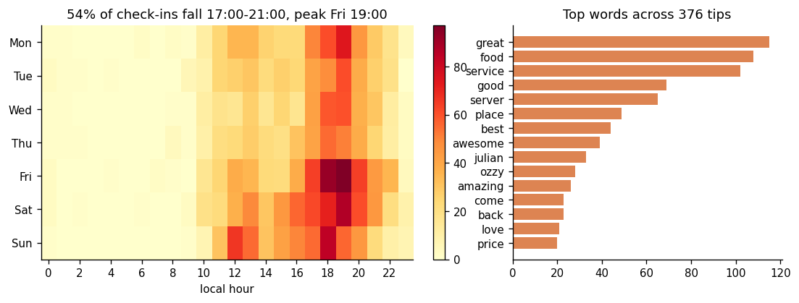

**When:** 54.3% of check-ins fall between 17:00 and 21:00, peaking Friday 19:00. Friday and Saturday carry 36% of the week; Wednesday is quietest at 11%.

**What customers remember:** two server names — *Julian* (33 mentions) and *Ozzy* (28) — appear more often in tips than *korean* (20) or *bbq* (20). The most repeatable asset this restaurant has is named staff, which is a scheduling and retention finding rather than a menu one.

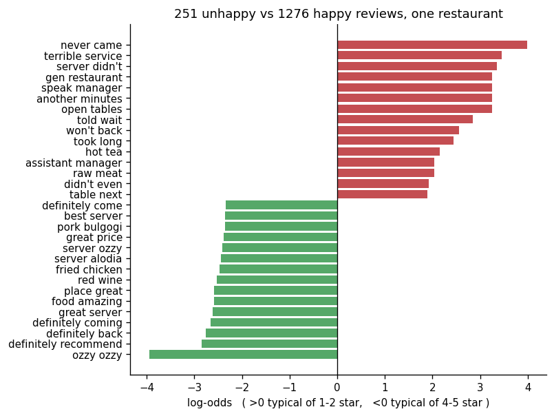

**What the unhappy reviewers say:** the same log-odds contrast applied to bigrams within one business, 1-2 star versus 4-5 star reviews. The complaint phrases are almost entirely about waiting and service response — *never came* (18 vs 0), *terrible service* (10 vs 0), *server didn't* (9 vs 0), *open tables*, *speak manager*, *told wait*, *took forever*, *another server*, *raw meat*. 46.6% of 1-2 star reviews mention waiting versus 29.9% of 4-5 star reviews.

That reproduces the cross-restaurant finding in §5 from a completely different direction: one business's own reviews rather than 12,000 businesses' tips.

---

## 8. Limitations

- **Check-ins are a proxy, not footfall.** They measure customers who open the Yelp app at a venue.
- **Text data is self-selected.** Every result in §5 and §6 describes reviewers, not customers.
- **Rating-vs-closure is confounded** with business age and review count. Descriptive only.
- **Keyword themes miss paraphrase** and count topic mentions rather than complaints.
- **Elite's useful-vote advantage is confounded** with display position and review age.
- **Timezone conversion uses standard-time offsets**, blurring roughly half the observations by an hour.
- **11 metros, data ends 2017.** Nothing generalises to a city outside the set.

---

## 9. What would come next

1. **An Elite ranking experiment** — the only way to separate review quality from display position. Primary metric: useful votes per review within 30 days of posting, randomised at review level.
2. **Aspect-based sentiment** on reviews (wait, staff, food, price, cleanliness) to replace the keyword lexicons.
3. **A closure risk model** once closure dates exist, so `is_open` can support a hazard model rather than a snapshot comparison.

---

## 10. Repository layout and reproduction

```
yelp-stakeholder-analysis/
├── README.md
├── INTERVIEW_GUIDE.md            # method walkthrough, worked examples, likely questions
├── requirements.txt
├── .gitignore
├── notebooks/
│   └── yelp_analysis.ipynb       # the whole analysis, top to bottom
├── figures/                      # 14 figures, written by the notebook
├── outputs/
│   ├── results.json              # every number quoted in this README
│   ├── checkins_local_weekday_hour.csv
│   ├── checkin_hour_profile.csv
│   ├── tip_word_logodds.csv
│   └── gen_kbbq_bigram_logodds.csv
└── data/                         # not committed — see below
    └── .gitkeep
```

### Data

The seven CSVs are 4 GB and are not committed. Download them from the [Kaggle Yelp Dataset](https://www.kaggle.com/datasets/yelp-dataset/yelp-dataset) (or [this Drive folder](https://drive.google.com/drive/folders/1l7RS8dcwW9lT_2hV5LBDtMcj-WdD_Pv9?usp=drive_link)) into `data/`:

```
data/
├── yelp_business.csv          31 MB
├── yelp_business_hours.csv    16 MB
├── yelp_checkin.csv          181 MB
├── yelp_tip.csv              108 MB
├── yelp_review.csv           3.8 GB
└── yelp_user.csv             1.3 GB
```

### Running

Locally:

```bash
pip install -r requirements.txt
jupyter lab notebooks/yelp_analysis.ipynb
```

On Colab, mount Drive and point `YELP_DATA_DIR` at the data folder before running the imports cell:

```python
from google.colab import drive; drive.mount('/content/drive')
import os
os.environ['YELP_DATA_DIR'] = '/content/drive/My Drive/DS_Project_Portfolio/Yelp-analysis/data/'
!pip -q install textblob
```

Use a High-RAM runtime — the review table with text occupies about 6 GB. The check-in and tip sections run in about two minutes; the review section is dominated by TextBlob scoring 40,000 sampled reviews, roughly five minutes. Every figure is saved to `figures/` and displayed inline; every quoted number is written to `outputs/results.json`.
