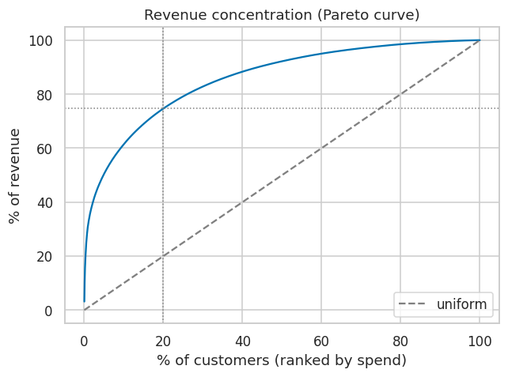
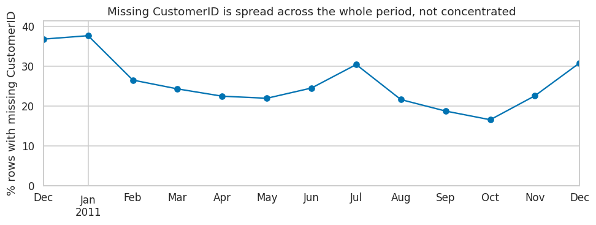
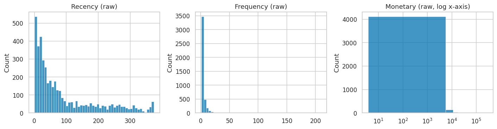
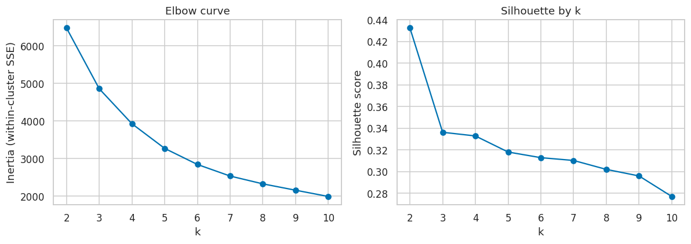
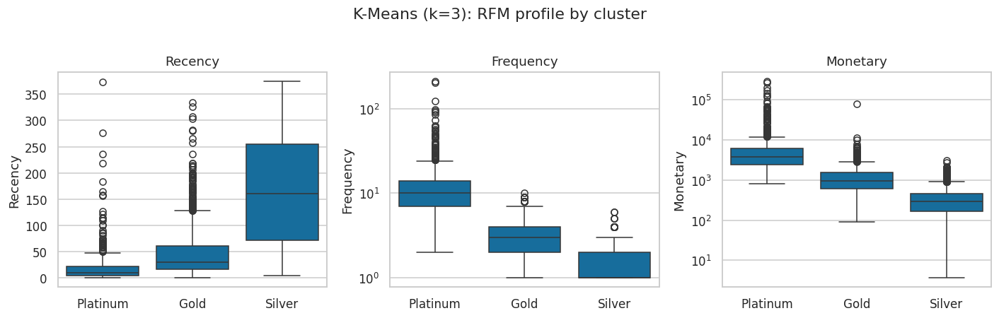
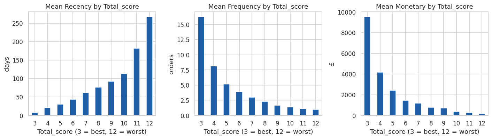
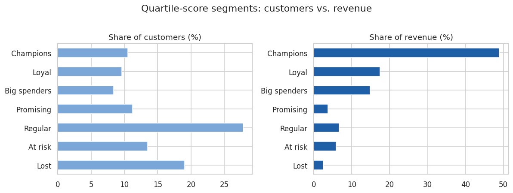

# Customer Segmentation for a UK Online Retailer
### RFM analysis, K-Means clustering, and quartile scoring on 542K transactions

> **The top 20% of customers generate 75% of revenue, and a third of the customer base has never placed a second order.** This project turns one year of raw transaction logs into a customer segmentation that marketing can act on, compares three segmentation methods, and recommends an action and a first experiment per segment.



---

## 1. Business context

The data comes from a UK-based, online-only retailer of unique all-occasion giftware. Most customers are wholesalers. The dataset ([UCI Online Retail](https://archive.ics.uci.edu/dataset/352/online+retail)) covers every transaction from 2010-12-01 to 2011-12-09: 541,909 line items across 38 countries.

**The problem.** Marketing treats the customer base as one list. Every customer receives the same campaign at the same frequency with the same discount. There is no view of who is worth a retention budget, who is new and worth developing, and who has already churned.

**The question.** Can transaction history alone — no demographics, no survey data — support a segmentation that is stable enough to allocate a marketing budget against?

**The answer.** Yes. A three-tier K-Means segmentation and a finer quartile-based RFM score both separate customers cleanly on behaviour and revenue contribution. One important caveat came out of the analysis: RFM space for this business is a **continuum with a long tail, not a set of natural clusters**, so segment boundaries should be presented to stakeholders as a management convention rather than a discovery.

---

## 2. Data problems and how they were handled

Before any modelling, five data-quality issues had to be resolved. Each changes the answer, so each is documented with the decision and the reason.

| Issue | Size | Decision | Reason |
|---|---|---|---|
| **Missing `CustomerID`** | 135,080 rows (24.9%) | Drop | RFM is customer-level; unattributable rows cannot contribute. The missing rows are spread evenly across all 13 months (Fig. 1), consistent with guest checkout rather than a logging outage, so dropping them does not bias the time coverage. |
| **Exact duplicate rows** | 5,225 rows | Drop | Same invoice, product, quantity, price, timestamp: double-entered lines, not separate purchases. |
| **Cancellations** (`InvoiceNo` starts with `C`, negative `Quantity`) | 8,872 rows | Drop, don't net | Monetary is a proxy for *purchase intent*. A customer who ordered £80K and returned it still demonstrated engagement. Netting would be correct for a revenue report, not for segmentation. |
| **Zero-price lines** | 40 rows | Drop | Free samples and adjustments, not purchases. |
| **Non-product codes** (`POST`, `M`, `DOT`, `BANK CHARGES`) | £150K (1.7% of revenue) | Keep | Postage a customer paid is real revenue to the business. Immaterial to the segmentation; must be excluded from any product-level analysis. |


*Figure 1 — Share of rows with a missing customer, by month. Flat across the year: guest checkout, not a data gap.*

A sixth finding does not affect RFM but matters for future work: there are 4,070 unique product codes but 4,223 unique descriptions. The same product is described inconsistently, so product analysis must key on `StockCode`, never on `Description`.

**Result:** 392,692 clean transactions, 18,532 invoices, **4,338 customers**, £8.89M revenue.

---

## 3. The RFM table

One row per customer:

| Metric | Definition | Design choice |
|---|---|---|
| **Recency** | Days from last invoice to snapshot date | Snapshot = last date in data + 1 day, so a customer who bought on the final day scores 1, not 0 |
| **Frequency** | Number of **distinct invoices** | Line items would measure basket breadth. A wholesaler buying 40 SKUs once is not more loyal than one buying 2 SKUs ten times |
| **Monetary** | Σ `Quantity × UnitPrice` | Gross revenue over the period |


*Figure 2 — All three metrics are heavily right-skewed. Median Monetary is £674; the mean is £2,049; the maximum is £280K.*

Two facts from this table drive everything else:

- **Revenue is concentrated.** Top 5% of customers → 50% of revenue. Top 20% → 75%. Top 50% → 92%.
- **34.4% of customers have placed exactly one order.** Converting first-time buyers is the single largest opportunity in the base — arguably bigger than retention.

---

## 4. Three segmentation methods

The notebook builds three segmentations on the same RFM table and compares them.

### A. Classic 8-segment grid (mean split)

Each dimension is flagged high/low at its mean, giving 2³ = 8 named cells (Champions, Loyal at risk, Big new spenders, and so on). Simple and conventional, but on skewed data it is badly unbalanced: 70% of customers collapse into two cells, while three of the "lapsed but valuable" cells hold fewer than 40 customers each. Two levels per dimension is also too coarse to target with.

### B. K-Means clustering (k = 3)

Features were **log-transformed and standardised** before fitting. Without this, Monetary — which spans four orders of magnitude — dominates Euclidean distance completely and the "clusters" are just spend bands.


*Figure 3 — Elbow and silhouette for k = 2…10. Silhouette peaks at k = 2 (0.43) and decays smoothly; the elbow has no bend.*

Both diagnostics say the same thing: there is no strongly preferred k because there is no strong cluster structure. **k = 3 was chosen as a business decision**, not a statistical one — it is the smallest k that yields three tiers with distinct behaviour and revenue contribution, and it maps onto a Platinum / Gold / Silver programme marketing can run.


*Figure 4 — RFM profile by cluster. The tiers separate cleanly on all three dimensions.*

| Tier | Customers | Share of customers | Share of revenue | Median R / F / M |
|---|---:|---:|---:|---|
| **Platinum** | 775 | 17.9% | **68.7%** | 10 days / 10 orders / £3,701 |
| **Gold** | 1,697 | 39.1% | 23.7% | 30 days / 3 orders / £962 |
| **Silver** | 1,866 | 43.0% | 7.6% | 160 days / 1 order / £296 |

**Robustness check with DBSCAN.** K-Means always returns k clusters, even on structureless data. DBSCAN, a density-based method free to return any number of clusters, was run on the same features (eps = 0.5 from the k-distance plot, min_samples = 5). It found one dense core (2,791 customers, 64% of revenue), one region of lapsed one-time buyers (1,485 customers, 6% of revenue), and **62 "noise" points that are the highest-spending accounts in the business** — median £28K, 31% of total revenue. They are flagged as noise because there are too few of them to form a dense region, not because they are errors. This confirms the continuum-plus-tail reading and produces a concrete list of accounts for named account management.

### C. Quartile RFM score

Each dimension scored 1–4 by quartile with **1 = best throughout** (lowest Recency quartile → 1; highest Frequency and Monetary quartiles → 1). Two composites: `RFMScore` (concatenated, e.g. `144`, preserves which dimension is weak) and `Total_score` (summed, 3–12, orderable). 61 of 64 combinations are occupied.


*Figure 5 — Mean R, F, M by `Total_score`. All three move monotonically with no inversions: score 3 averages £9,547 and 8 days; score 12 averages £163 and 268 days — a 58× spread in spend.*

Seven mutually exclusive named segments are then built from the scores in priority order:


*Figure 6 — Customer share vs. revenue share by segment. Champions are 10.5% of customers and 48.9% of revenue.*

### Which method to use when

| Method | Best for | Weakness |
|---|---|---|
| 8-segment grid | Executive summary, first pass | Unbalanced and coarse on skewed data |
| K-Means (k = 3) | Tiered loyalty programme | k is a convention; boundaries shift on refit; a single customer's assignment is hard to explain |
| Quartile score | Campaign targeting and suppression lists | Ties in Frequency; 64 cells need collapsing into named segments |

The three methods agree on the extremes — K-Means Platinum is almost entirely Champions / Loyal / Big spenders; K-Means Silver is almost entirely Lost / At risk. They differ in the middle, which is exactly where method choice is a judgement call.

---

## 5. SQL implementation

The RFM table and the 8-segment grid are re-implemented in SQL against SQLite loaded with the cleaned transactions, and a set of assertions confirms the SQL output matches pandas on every one of the 4,338 customers (R, F, M, and segment code). This is the form the logic would take in a production warehouse, and an independent check that the pandas implementation is correct.

---

## 6. Recommendations

| Segment | Customers | % of revenue | Median spend | Action |
|---|---:|---:|---:|---|
| **Champions** | 455 | 48.9% | £4,114 | Early access to new products; referral ask; **no discounting** |
| **Loyal** | 417 | 17.4% | £2,299 | Volume-tier pricing; cross-sell adjacent categories |
| **Big spenders** | 363 | 14.9% | £2,247 | Replenishment reminders timed to their cycle |
| **Promising** | 486 | 3.7% | £638 | Second-purchase offer within 30 days of first order |
| **Regular** | 1,206 | 6.6% | £393 | Standard cadence |
| **At risk** | 585 | 5.9% | £856 | Win-back campaign now — highest expected reactivation ROI |
| **Lost** | 826 | 2.5% | £244 | Suppress from paid retargeting |

Plus the 62 DBSCAN tail accounts, which should be handled by named account managers rather than any automated flow.

**First experiment.** The segmentation is descriptive: it shows groups differ today, not that treating them differently changes behaviour. The cheapest way to make it causal is an A/B test on the **At risk** segment — win-back email vs. no contact, randomised at customer level, 30-day reactivation rate as the primary metric, powered on the observed baseline before launch.

---

## 7. Limitations

- **One year of data.** Segment stability over time is assumed, not shown.
- **Monetary is historical spend, not predicted value.** A BG/NBD + Gamma-Gamma customer-lifetime-value model is the natural next step.
- **Guest checkouts (25% of raw rows) are excluded.** If those orders are a large share of revenue, budgets sized from these segments understate the total.
- **Returns are dropped, not netted.** Serial returners are overvalued; return rate per customer should be a feature in a second iteration.
- **Quartile boundaries are computed on the full population.** In production they should be frozen from a reference period.

---

## 8. Repository layout and reproduction

```
rfm-customer-segmentation/
├── README.md
├── requirements.txt
├── data/
│   └── online_retail.csv          # not committed; download link below
├── notebooks/
│   └── rfm_analysis.ipynb         # end-to-end analysis, fully commented
├── figures/                       # generated by the notebook
└── outputs/
    └── rfm_segments.csv           # one row per customer, all three segmentations
```

```bash
git clone https://github.com/LeonZHXing/DS_Project_Portfolio.git
cd DS_Project_Portfolio/rfm-customer-segmentation
pip install -r requirements.txt
# download the data (see links below) and save it as data/online_retail.csv
jupyter lab notebooks/rfm_analysis.ipynb

**Data download**

- Original source: [UCI Online Retail](https://archive.ics.uci.edu/dataset/352/online+retail) (`.xlsx`, export to CSV)
- Mirror (CSV, ready to use): [Google Drive](https://drive.google.com/file/d/1Q-iw_erFv1jo4EaRkyM4nrxSb2GBro3p/view?usp=drive_link)
```

Runs end to end in under two minutes on a laptop. Python 3.10+, no GPU, no cloud account.
